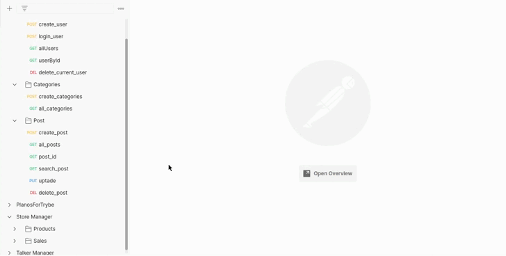
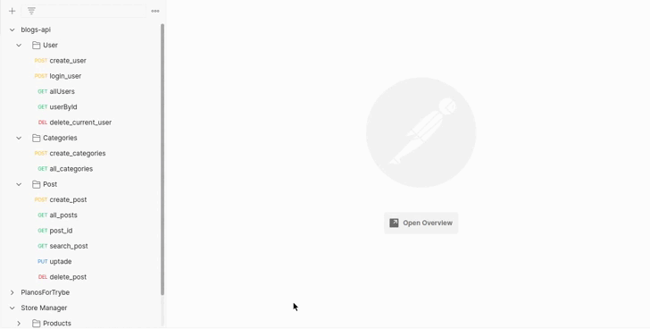

<div align="center"> 
    
</div>

<br>
<br>
<br>


<div align="center"> 
    
</div>

<br>
<br>

# Sumario
   - [Sobre](#sobre)
   - [Tecnologias](#tecnologias-utilizadas)
   - [Habilidades](#habilidades-desenvolvidas)
   - [Instruções](#instruções)
#

# Sobre

### Projeto desenvolvido enquanto estudante na [trybe](https://www.betrybe.com/formacao-desenvolvimento-web), me mantive utilizando a arquitetura MSC(model, service, controller), a API se refere a um blog, foram implementadas 13 rotas, com diferentes funções, como deletar, atualizar e criar, cada rota conta com um ou alguns middlewares de verificação das regras de negocio, lançando diferentes tipos de status codes, os diferenciais desse projeto foram, realização de models através de sequelize, criação de migrates, para criação do banco, tabelas e colunas e por fim a utilização de JWT(json web token) para autenticação de rotas.

#

# Tecnologias utilizadas
- [Postman](https://www.postman.com/)
- [MySQL Workbench](https://www.mysql.com/products/workbench/)
- [Node.js](https://nodejs.org/en/about/)
- [express](https://expressjs.com/pt-br/)
- [SQL](https://www.w3schools.com/sql/)
- [Sequelize](https://sequelize.org/)
#

# Habilidades desenvolvidas
- Criar e associar tabelas usando models do sequelize
- Construir endpoints para consumir os models que criar
- Fazer um CRUD com o ORM

- Usar ORM com pacote sequelize do npm

#

# Instruções

```bash
    # Clonar repositório

    $ git clone git@github.com:furquin/blogs-api.git
    # Entrar no diretório

    $ cd blogs-api

    # Instalar dependências

    $ npm install

    # Iniciar a aplicação com nodemon

    $ npm run debug

    # Iniciar banco e migrates

    $ npm run prestart

    # Popular dados no banco de dados

    $ npm run seed

    # Dropar o banco de dados

    $ npm run drop

```

<br>
<br>
<br>

### Desenvolvido por [Laert Furquin](https://github.com/furquin) 

